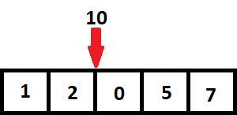
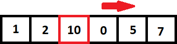

# Arreglos

> **Tabla de Contenidos**
> * [Definición](#Definición)
> * [Arreglos estáticos](#Arreglos estáticos)
>   * [Declaración](#Declaración)
>   * [Acceso y almacenamiento](#Acceso y almacenamiento)
> * [Arreglos dinámicos](#Arreglos dinámicos)
>   * [Declaración](#Declaración)
>   * [Acceso y almacenamiento](#Acceso y almacenamiento)
>   * [Agregar al final/quitar del final](#Agregar al final/quitar del final)
>   * [Insertar/eliminar en cualquier posicion del vector](#Insertar/eliminar en cualquier posicion del vector)
> * [Funciones útiles](#Funciones útiles)
>   * [Ordenar elementos](#Ordenar elementos)
>   * [Buscar elementos](#Buscar elementos)
> * [Referencias](#Referencias)
> * [Problemas](#Problemas)

## Definición

Los arreglos son una estructura de datos lineal que tiene los datos de manera contigua en la memoria. En este capítulo, se enseñaran respecto a los dos tipos de arreglos que existes: estáticos y dinámicos. En ambos casos, se estos permiten un acceso eficiente a un dato en tiempo $O(1)$ y también almacenamiento de un dato e tiempo $O(1)$. Pero, la principal diferencia entre ambos es que los arreglos dinámicos pueden aumentar y/o disminuir su tamaño durante la ejecución del programa.

Un arreglo tiene posiciones en los cuales se almacenaran los datos, a saber que si uno tiene un arreglo de tamaño $n$ la posición inicial será $0$ y la posición final será $n - 1$.

| posicion | 0 | 1 | 2 | 3 | 4 |
|----------|---|---|---|---|---|
| valor  | 1 | 0 | -10 | 2 | 3 |

Por ejemplo, en la tabla anterior se pude ver un arreglo de tamaño $5$ que almacena enteros. Donde, por ejemplo en la posición $2$ se encuentra el valor $-10$.

## Arreglos estáticos

Los arreglos estáticos tienen la característica que su tamaño se define una vez, este tamaño no puede aumentar ni disminuir. 

### Declaración

```cpp
#include<bits/stdc++.h> 
using namespace std;
 
int main(){
	// se inicializa un arreglo de enteros de tamaño 100
	// cada valor del arreglo, tiene valores dependiendo del
	// compilador

	// siempre el arreglo almacenará un tipo de dato
	int arr[100];

	// aquí se inicializa un arreglo de 10 números flotantes
	float flotantes[10];

	// un arreglo de 1000 caracteres
	char caracteres[1000];
	return 0;
}
```

### Acceso y almacenamiento

```cpp
#include<bits/stdc++.h> 
using namespace std;
 
int main(){
	// se inicializa un arreglo de enteros de tamaño 100
	// cada valor del arreglo, tiene valores dependiendo del
	// compilador
	int arr[100];

	// al valor en la posición 0, se almacenará 0. 	
	arr[0] = 0;

	// se accede al valor con [indice]
	int num = arr[0];

	// se muestra por pantalla los dos valores
	cout << num << " " << arr[0] << "\n";

	// se almacena el valor i, utilizando for
	for(int i = 0; i < 100; i++){
		arr[i] = i;
	}

	// se muestra por pantalla los valores de cada 
	// posición del arreglo
	for(int i = 0; i < 100; i++){
		cout << arr[i] << " ";
	}
	cout << "\n";
	return 0;
}
```

## Arreglos dinámicos

Los arreglos dinámicos tienen la característica que su tamaño puede variar durante la ejecución del programa. Para hacer uso de arreglos dinámicos, en C++ se utilizará lo que corresponde a un vector (en Java se ocupa ArrayList). Los vectores corresponden a un arreglo dinámico que tiene implementado ciertas funciones que permiten el manejo correcto de este mismo. Al igual que los arreglos estáticos, los vectores solo pueden tener un tipo de datos a la vez almacenado.

### Declaración

Se puede declarar un vector vació en C++. Para declarar una variable como vector se debe escribir lo siguiente `vector< tipo de dato >`.

```cpp
#include<bits/stdc++.h> 
using namespace std;
 
int main(){
	// se declara un vector vació de enteros
	vector< int > vec_int;

	// se declara un vector vació de caracteres
	vector< char > vec_char;

	// se declara un vector vació de flotantes
	vector< float > vec_float;

	// se declara un vector vació de vectores de enteros
	vector< vector< int > > vec_vectores;
	return 0;
}
```

También, uno puede declarar vectores con algún tamaño inicial y también con valores iniciales.

```cpp
#include<bits/stdc++.h> 
using namespace std;
 
int main(){
	// se declara un vector de 10 enteros
	vector< int > vec_10_int(10);

	// gracias a esta función pueden saber
	// cual es el tamaño del vector
	cout << vec_10_int.size() << "\n";

	// se declara un vector de n enteros
	// donde n es un valor que se agrega
	// por consola
	int n;
	cin >> n;
	vector< int > vec_n_int(n);
	cout << vec_n_int.size() << "\n";

	// se declara un vector de n enteros,
	// donde inicialmente los n enteros son -1
	vector< int > vec_n_zeros(n, -1);
	cout << vec_n_zeros.size() << "\n";


	return 0;
}
```

### Acceso y almacenamiento

Para poder acceder y almacenar valores en las posiciones de los vectores se hace igual que los arreglos estáticos a través de `vec[posicion]`.

```cpp
#include<bits/stdc++.h> 
using namespace std;
 
int main(){
	int n;
	cin >> n;

	// se declara un vector de n enteros,
	// donde inicialmente los n enteros son -1
	vector< int > vec_n_zeros(n, -1);

	// se muestra por pantalla el valor actual
	// de cada posición y se actualiza la posición
	// con el valor i
	for(int i = 0; i < vec_n_zeros.size(); i++){
		cout << vec_n_zeros[i] << " ";
		vec_n_zeros[i] = i;
	}
	cout << "\n";

	// se calcula la suma de los n enteros almacenados
	// en el for anterior
	int suma = 0;
	for(int i = 0; i < vec_n_zeros.size(); i++){
		suma += vec_n_zeros[i];
	}

	cout << suma << "\n";
	return 0;
}
```

### Agregar al final/quitar del final

Ahora, ya sabemos como declarar, accede y almacenar, pero también podemos añadir y quitar elementos del final de un vector. Para añadir al final de un vector usamos la función `vec.push_back(valor)` y para quitar el valor del final del vector usamos la función `vec.pop_back()`.

```cpp
#include<bits/stdc++.h> 
using namespace std;
 
int main(){
	vector< int > vec(10);

	for(int i = 0; i < vec.size(); i++){
		vec[i] = i;
	}

	cout << "Tamano vector: " << vec.size() << "\n";
	cout << "Valores: ";
	for(int i = 0; i < vec.size(); i++){
		cout << " " << vec[i];
	}
	cout << "\n";

	// eliminamos el valor del final
	vec.pop_back();

	cout << "Tamano vector: " << vec.size() << "\n";
	cout << "Valores: ";
	for(int i = 0; i < vec.size(); i++){
		cout << " " << vec[i];
	}
	cout << "\n";

	// se agrega 1111 al final del vector
	vec.push_back(1111);

	cout << "Tamano vector: " << vec.size() << "\n";
	cout << "Valores: ";
	for(int i = 0; i < vec.size(); i++){
		cout << " " << vec[i];
	}
	cout << "\n";
	return 0;
}
```

Ambas funciones al tener que agregar solo al final, estas funciones tienen una complejidad de $O(1)$, ya que simplemente debe agregar un nuevo espacio al final del vector y almacenar el valor nuevo, para quitar es la misma idea, pero disminuyendo el tamaño del vector.

### Insertar/eliminar en cualquier posicion del vector

Además de poder agregar o quitar del final, se puede insertar o eliminar de cualquier posición del arreglo. Esto se puede hacer utilizando las funciones `vec.insert(puntero a la posicion, valor)` y `vec.erase(puntero a la posicion)`.

```cpp
#include<bits/stdc++.h> 
using namespace std;
 
int main(){
	vector< int > vec(10);

	for(int i = 0; i < vec.size(); i++){
		vec[i] = i;
	}

	// para acceder al puntero de la posicion
	// se hace uso de .begin() que entrega
	// un puntero para la posición inicial, luego debes sumar 
	// lo que debes sumar para llegar a la posición deseada

	// en este caso estoy insertando 245003 en la posición 2 del vector
	vec.insert(vec.begin() + 2,  245003);	

	cout << "Tamano vector: " << vec.size() << "\n";
	cout << "Valores: ";
	for(int i = 0; i < vec.size(); i++){
		cout << " " << vec[i];
	}
	cout << "\n";

	// en el caso de erase es la misma lógica que con la
	// función insert

	// en este caso estoy eliminando el valor en la posición 3
	vec.erase(vec.begin() + 3);

	cout << "Tamano vector: " << vec.size() << "\n";
	cout << "Valores: ";
	for(int i = 0; i < vec.size(); i++){
		cout << " " << vec[i];
	}
	cout << "\n";
	return 0;
}
```

Aunque las funciones que vimos anteriormente eran de complejidad $O(1)$, pero ¿insert/erase serán $O(1)$? Estudiemos el porque.

Veamos la representación de cuando uno intenta insertar un elemento en la posición de un arreglo. En este caso, queremos insertar el valor $10$ en la posición $2$ del arreglo.

<p align="center">
  
</p>

Como se indicó en la [definición](#Definición), los arreglos son una estructura de datos de memoria contigua, por lo tanto para poder ingresar el $10$ se debem mover todos los numeros a la derecha $1$ espacio hacia la derecha.

<p align="center">
  
</p>

En la imagen, se visualiza como se tuvieron que mover $3$ enteros. Ahora, esta cantidad de números puede ser $3$ enteros o todos los enteros del arreglo, esto dependiendo de la posición en que uno quiera insertar el valor. Por lo que, la complejidad de una inserción es $O(n)$. Para la función erase se puede hacer un trabajo simular con respecto a como se mueven los los valores, provocando que su complejidad sea igualmente $O(n)$.

## Funciones útiles

Además de las mismas funciones que usan los arreglos, también existen funciones implementadas en la librería STL, tanto para buscar datos como ordenar los datos de los arreglos.

### Ordenar elementos

Para ordenar elementos en los arreglos se puede hacer uso la función implementada en la librería STL, aunque si no uno quiere hacer una tarea en especifico talvez sea mejor programar su propia función de sort. Pero, por ahora utilicemos simplemente la función de la librería STL. Esta función se llama `sort(puntero principio, puntero final)`.

```cpp
#include<bits/stdc++.h> 
using namespace std;
 
int main(){
	int n;
	cin >> n;

	// aquí estamos asumiendo que solo ingresarán
	// máximo 10000 de enteros, o sea n <= 10000
	int arr[10000];
	for(int i = 0; i < n; i++){
		cin >> arr[i];
	}

	// a los arreglos ser punteros arr ya es el puntero
	// al princio y arr + n corresponde al puntero final
	sort(arr, arr + n);

	cout << "Tamano arreglo: " << n << "\n";
	cout << "Valores: ";
	for(int i = 0; i < n; i++){
		cout << " " << arr[i];
	}
	cout << "\n";

	// ordenando un vector
	vector< int > vec(n);

	for(int i = 0; i < n; i++){
		cin >> vec[i];
	}

	// en caso de vectores utilizaremos la función
	// .begin() para obtener el puntero al principio
	// y .end() para obtener el puntero al final
	sort(vec.begin(), vec.end());

	cout << "Tamano vector: " << vec.size() << "\n";
	cout << "Valores: ";
	for(int i = 0; i < vec.size(); i++){
		cout << " " << vec[i];
	}
	cout << "\n";
	return 0;
}
```

También si uno lo require puede añadir una función personalidad para ordenar los números. Por default, C++ ordena los valores de menor a mayor, si uno quiere ordenar de otra forma debe hacer otra función que lo permita y pasarlo como parámetro a la función.

```cpp
#include<bits/stdc++.h> 
using namespace std;

// para ordenar debe retornar un booleando
// y debe recibir dos elementos `a` y `b`
// la función debe retornar:
//	* verdadero: si es que `a` va a la izquierda de `b`
// 	* falso: si es que `a` va a la derecha de `b`
bool mayor_a_menor(int a, int b){
	if(a >= b){
		return true;
	} else {
		return false;
	}
}
 
int main(){
	int n;
	cin >> n;
	// ordenando un vector
	vector< int > vec(n);

	for(int i = 0; i < n; i++){
		cin >> vec[i];
	}

	// para ordenar según la función deseada se agrega
	// como tercer parámetro
	sort(vec.begin(), vec.end(), mayor_a_menor);

	cout << "Tamano vector: " << vec.size() << "\n";
	cout << "Valores: ";
	for(int i = 0; i < vec.size(); i++){
		cout << " " << vec[i];
	}
	cout << "\n";
	return 0;
}
```

Otro dato muy poderoso es que se pueden ordenar todo tipo de dato comparable. Esto significa que se pueden ordenar arreglos de caracteres, flotantes, pares (una estructura que almacena dos elementos), strings, vectores, etc. También esta función es eficiente y tiene una complejidad de $O(n \log n)$.

### Buscar elementos

Para buscar elementos en los arreglos se puede buscar de izquierda a derecha, pero eso tomaría $O(n)$ en el peor caso, donde $n$ es el tamño del arreglo. Ahora bien, si uno supiera que el arreglo esta ordenado, uno puede aplicar lo que se conoce como búsqueda binaria y esto esta implementado en tres funciones `upper_bound(puntero principio, puntero final, valor a buscar)`, `lower_bound(puntero principio, puntero final, valor a buscar)`, `binary_search(puntero principio, puntero final, valor a buscar)`. Un dato importante para el uso de estas funciones es que el arreglo debe estar ordenado, sino no tiene sentido utilizar estas funciones. 

Por último, la complejidad de estas funciones es $O(\log n)$ lo cual es bastante eficiente.

#### Lower Bound

Esta función busca el primer valor que sea **menor o igual** al valor que se busca. Si es que hay varios números iguales al valor que se busca, se retornará el de más a la izquierda. Además, `lower_bound` retorna un iterador a la posición del valor (en escencia se puede entender el iterador como un puntero) y para obtener la posición del elemento se debe aplicar `iterador obtenido - iterador de principio`.

```cpp
#include<bits/stdc++.h> 
using namespace std;

int main(){
	vector< int >::iterator low;
	vector< int > v = {1, 1, 1, 3, 5};

	low = lower_bound(v.begin(), v.end(), 2);
	if(*low == 2){
		cout << "El numero " << *low;
		cout << " esta en la posicion ";
		cout << low - v.begin() << "\n";
	} else {
		cout << "El numero 2 no se encontro\n";
	}
	return 0;
}
```

Esta función busca el primer valor que sea **mayor** al valor que se busca. Además, `lower_bound` retorna un iterador a la posición del valor (en escencia se puede entender el iterador como un puntero) y para obtener la posición del elemento se debe aplicar `iterador obtenido - iterador de principio`.

#### Upper Bound

```cpp
#include<bits/stdc++.h> 
using namespace std;

int main(){
	vector< int >::iterator up;
	vector< int > v = {1, 2, 2, 3, 4};

	up = upper_bound(v.begin(), v.end(), 2);
	cout << "El numero " << *up;
	cout << " esta en la posicion ";
	cout << up - v.begin() << "\n";
	return 0;
}
```

#### Binary Search

Esta función retorna verdadero o falso dependiendo si es que el valor se encuentra en el arreglo o no.

```cpp
#include<bits/stdc++.h> 
using namespace std;

int main() {
	vector< int > v = {1, 2, 2, 3, 4};

	if(binary_search(v.begin(), v.end(), 3)) {
		cout << "Se encontro el numero 3\n";
	} else {
		cout << "No se encontro el numero 3\n";
	}
	
	return 0;
}   
```

## Referencias

Para más consultas respecto a lo estudiado en este capítulo.

* Vectores - [https://www.cplusplus.com/reference/vector/vector/](https://www.cplusplus.com/reference/vector/vector/)
* Sort - [https://www.cplusplus.com/reference/algorithm/sort/](https://www.cplusplus.com/reference/algorithm/sort/)
* Upper bound - [https://www.cplusplus.com/reference/algorithm/upper_bound/](https://www.cplusplus.com/reference/algorithm/upper_bound/)
* Lower bound - [https://www.cplusplus.com/reference/algorithm/lower_bound/](https://www.cplusplus.com/reference/algorithm/lower_bound/)
* Binary search - [https://www.cplusplus.com/reference/algorithm/binary_search/](https://www.cplusplus.com/reference/algorithm/binary_search/)


## Problemas

Aquí se deja un listado de problemas que se pueden resolver con lo aprendido (ojo que los problemas no necesariamente estan en orden de fácil o díficil):


* 10038 Jolly Jumpers <br>[https://onlinejudge.org/index.php?option=com_onlinejudge&Itemid=8&category=623&page=show_problem&problem=979](https://onlinejudge.org/index.php?option=com_onlinejudge&Itemid=8&category=623&page=show_problem&problem=979)
* 482 Permutation Arrays <br>[https://onlinejudge.org/index.php?option=com_onlinejudge&Itemid=8&category=623&page=show_problem&problem=423](https://onlinejudge.org/index.php?option=com_onlinejudge&Itemid=8&category=623&page=show_problem&problem=423) 
* 591 Box of Bricks <br> [https://onlinejudge.org/index.php?option=com_onlinejudge&Itemid=8&category=623&page=show_problem&problem=532](https://onlinejudge.org/index.php?option=com_onlinejudge&Itemid=8&category=623&page=show_problem&problem=532)
* 10703 Free spots <br> [https://onlinejudge.org/index.php?option=com_onlinejudge&Itemid=8&category=624&page=show_problem&problem=1644](https://onlinejudge.org/index.php?option=com_onlinejudge&Itemid=8&category=624&page=show_problem&problem=1644)
* 339A Helpful Maths<br>[https://codeforces.com/problemset/problem/339/A](https://codeforces.com/problemset/problem/339/A)
* 1618A Polycarp and Sums of Subsequences <br> [https://codeforces.com/problemset/problem/1618/A](https://codeforces.com/problemset/problem/1618/A)
* 1334B Middle Class <br> [https://codeforces.com/problemset/problem/1334/B](https://codeforces.com/problemset/problem/1334/B)
