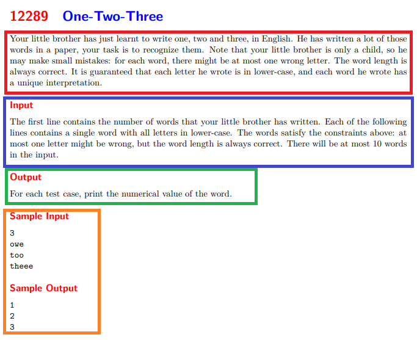

# ¿Qué es la Programación Competitiva?

> **Tabla de Contenidos**
> * [¿Qué es la Programación Competitiva?](#¿que-es-la-programacion-competitiva?)
> * [Juez online y Problemas](#juez-online-y-problemas)
>   * [Juez Online](#juez-online)
>   * [Los problemas](#los-problemas)
> * [Los lenguajes de programación en ProgComp](#los-lenguajes-de-programación-en-progcomp)

## ¿Qué es la Programación Competitiva?

La programación competitiva corresponde de una disciplina en la cual uno tiene un plazo definido de tiempo para poder resolver una cierta cantidad de problemas. Estos problemas corresponden a algún problema que se puede resolver a través de la programación en uno o más lenguajes. 

Esta disciplina posee competencias a nivel de equipo como individual. La más conocida corresponde a la ACM-ICPC, esta competencia consiste en equipo de tres personas para resolver una cantidad de problemas N, donde en general $9 <= N <= 14$. Estos problemas contienen especialmente tópicos de algoritmos y estructuras de datos, dando como posibilidad resolverlos en C++, Java, Python y Kotlin. 

Lo que hace realmente interesante este tipo de competencias es que para poder resolver un problema uno debe desarrollar algún algoritmo que sea eficiente a nivel de tiempo y espacio, dependiendo de lo descrito en el problema mismo, escondiendo la solución de algún enunciado entretenido o meme.

Ahora, de seguro se preguntarán: ¿Para qué me sirve a parte de pasarla bien? Al participar en esta disciplina adquieren habilidades codiciadas por las grandes empresas de informática, tales como:

* resolución de problemas complejos
* generación de soluciones eficiente en espacio y tiempo
* desarrolló de soluciones en tiempos cortos

## Juez online y Problemas

Para participar o practicar se utilizar alguna página que tenga implementado un juez online y posee problemas que tengan el formato correspondiente. Primero, mencionemos lo que es un juez online y luego explicaremos cual es el formato de los problemas.

### Juez Online

Un juez online consiste en un programa en el cual uno puede subir su código con la solución de un problema y pueda verificar que su código efectivamente lo resuelva. Para ello, esta arma un set de casos de prueba secreto con el cual prueba su código y fija un tiempo límite para caso de prueba. Y si pasa todos los casos de prueba, entonces será aceptado. Existen diversas respuestas de un juez online para cuando uno sube un código y estas son:

* **Accepted** o **AC**: la mejor respuesta que te pueda dar, ya que significa que tu código pasó los casos de prueba y siempre con un tiempo menor que el tiempo límite.
* **Wrong Answer** o **WA**: tu código fallo en un caso de prueba, no te dicen cual, simplemente te dice que falló. Lo interesante de esta respuesta, es que en general los jueces pruebas los casos 1 por 1 y cuando un caso sale incorrecto dejan de probar
* **Time Limit Exceeded** o **TLE**: tu código superó el tiempo límite de algún caso de prueba, o sea tu respuesta es ineficiente en tiempo. Lo interesante de esta respuesta, es que, al nunca terminar el caso de prueba, no sabes si es que tu respuesta es incorrecta, ya que no entregó la respuesta completa, solo sabes que se demoró mucho (opinión personal: esta es la peor respuesta).
* **Memory Limit Exceeded** o **MLE**: tu código superó el espacio de memoria permitido, muy pocas veces he visto que esto pase, pero significa que debes de alguna forma reducir el uso de memoria.

Existen jueces online que son más permisivos y entregan más respuestas, pero estas son las 4 posibles respuestas (y las usadas en la ICPC). Al principio, uno puede encontrar los jueces pesados y es verdad. Esto permite moldear una metodología de trabajo en la cabeza de uno, donde se pone a pensar en soluciones a errores rápidamente, o poder encontrar errores en códigos que no suelen ser encontrados.

Aquí les dejo algunos de los jueces onlines que suenan más:

* [UVa Online Judge](https://onlinejudge.org/index.php)
* [Codeforces](https://codeforces.com)
* [Beecrowd](https://www.beecrowd.com.br)
* Existen muchos más, pero esto son los que yo tengo en mente

### Los problemas

Los problemas de la programación competitiva tienen un formato en particular. Al principio puede ser complejo adecuarse a ellos, pero cuando uno ya tiene un tiempo practicando se hacen más sencillos de manejar. El siguiente ejemplo corresponde a un problema de nivel fácil llamado One-Two-Three proveniente del juez online (UVa Online Judge):

  

Con este ejemplo, podrás visualizar las diferentes partes que existen en todos los problemas:

* **Enunciado** (rojo en la imagen): se describe el problema a resolver, indicando las posibles restricciones y/o objetivos.
* **Input** (azul en la imagen): se describe el cómo recibirás los datos por la entrada estándar y también las restricciones de los datos, lo importante a destacar es que todo input descrito es completamente estricto, esto quiere decir que si te dicen algo es porque será así, entonces no debes pensar que pueden entrar inputs incorrectos o mal escritos.
* **Output** (verde en la imagen): se describe el cómo debes entregar la respuesta, muy importante, porque al igual que el input, es completamente estricto, o sea que debes entregarlo sí o sí de esa forma, sino te dirá que es incorrecto
* **Ejemplos** (naranjo en la imagen): te muestran 1 o más ejemplos del problema, pueden llegar a ser útiles porque sirven para entender mejor el problema, pero no tienen que pensar "Me funcionaron los casos de prueba, ergo mi código esta 100% bueno". Es importante analizar los otros posibles casos de prueba.

También, en algunos jueces te indican cuanto es el tiempo límite de cada problema, pero a veces está descrito en la competencia misma y no en cada problema.

## Los lenguajes de programación en ProgComp

Como se indicó más arriba, se puede elegir que lenguaje utilizar para poder resolver un problema. Entre los más conocidos están: C++, Java y Python. El lenguaje más eficiente sería C++, por su sintaxis y rapidez. Java puede hacer la pelea a C++, pero su sintaxis no es tan cómoda para este tipo de disciplina. Python es un lenguaje lento, de hecho, a veces no te aseguran que con Python se pueda resolver el problema por su lentitud, pero tiene una ventaja: es muy rápido de escribir; cómo el tiempo es algo relevante en estas competencias, a veces Python puede ser útil para resolver problemas fáciles, ya que la sintaxis es simple.

**DISCLAIMER: todos los códigos usados en esta página estarán en C++ o Python (en el peor de los casos).**

### C++

Para aprender lo básico de C++ revisar el siguiente enlace: [Apunte UChile ProgComp](https://uchile.progcomp.cl/apunte/introduccion_a_cpp/compilacion_y_editores/). Cosas importantes que retener de lo básico de C++ son los tipos de datos, por ejemplo, el rango de números de un `int`, `long long int`, `unsigned int`, etc. Luego, también existe lo que la librería STL, la cual permite el uso de estructuras de datos eficientes, que serán estudiadas en los capítulos de EDD Lineales y EDD no Lineales.

### Python

En general, Python es un lenguaje bastante simple en sintaxis y se enseña en gran parte de las universidades que tienen programación en primer año como parte de plan común, de todas formas, si es que necesitan algo podrían consultar el siguiente enlace de w3schools: [https://www.w3schools.com/python/default.asp](https://www.w3schools.com/python/default.asp). En este enlace podrán aprender lo básico de Python, al igual que en C++ es importante saber los tipos de datos, también las herramientas que posee el lenguaje: listas, tuplas, diccionarios, etc.
